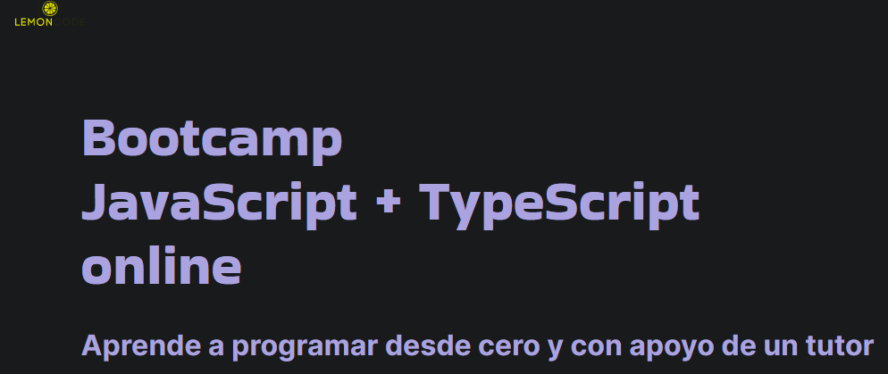

# [Bootcamp JavaScript + TypeScript online de Lemoncode](https://lemoncode.net/bootcamp-javascript#bootcamp-javascript/inicio)

Repositorio para realizar los ejercicios del bootcamp de JS y TS de Lemoncode

Temario:
* M00 Setup y git
* M01 HTML
* M02 Tipos de datos y Operadores
* M03 Variables
* M04 Funciones
* M05 Condicionales
* M06 Imports
* M07 Testing
* M08 Arrays y bucles
* M09 Algoritmos
* M10 Asincronía
* M11 Regex (Expresiones regulares)
* M12 Clases
* M13 React